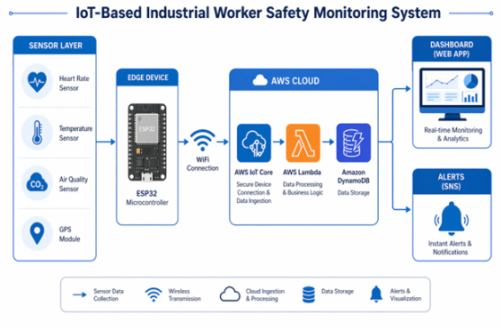
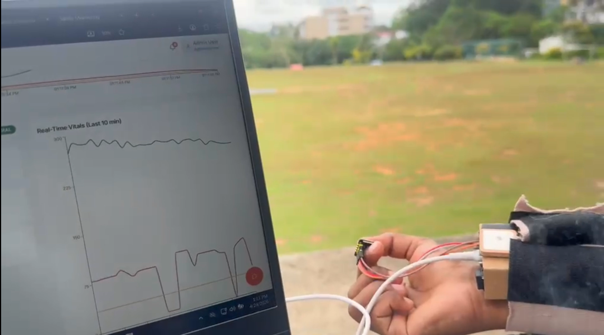
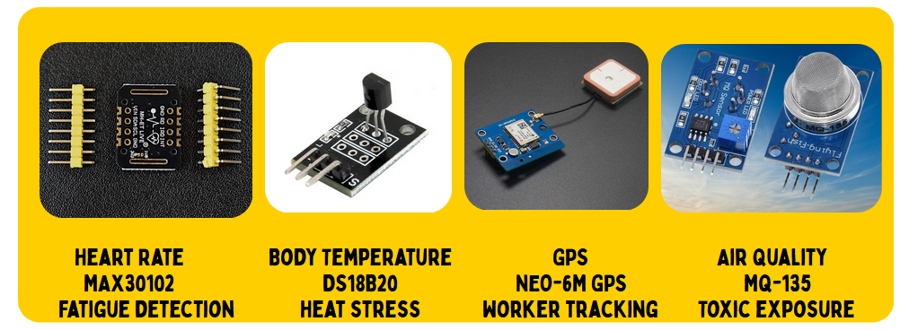

# Sentinel Monitoring Platform



Sentinel is a real-time safety monitoring system that streams sensor data to AWS, applies lightweight ML checks, and surfaces alerts in a React dashboard.



## Project Overview

- Frontend: React (Vite + TypeScript + shadcn)
- Backend: Express + DynamoDB
- Telemetry: AWS IoT Core -> Lambda -> DynamoDB
- Monitoring: live dashboards, alerts, and thresholds



## Installation

```sh
npm i
```

## Local Setup

1. Copy `.env.example` to `.env`.
2. Set these values:
	 - `VITE_BACKEND_API_URL`
	 - `VITE_EMPLOYEE_ID`
	 - `AWS_REGION`
	 - `DDB_EMPLOYEE_TABLE`
	 - `DDB_TELEMETRY_TABLE`
	 - `DDB_SETTINGS_TABLE`
	 - `DEFAULT_EMPLOYEE_ID`
3. Configure AWS credentials with `aws configure` or environment variables.

Run services:

```sh
npm run backend:dev
```

```sh
npm run dev
```

## Sensor Calibration (Short Guide)

### Temperature Sensor (DS18B20)

- Method: compare against a reference thermometer at room and elevated temps.
- Apply offset: `temperature = rawTemperature + calibrationOffset`.
- Typical offset: +/- 0.5C; smooth with moving average.

### Heart Rate Sensor (MAX30102)

- Method: compare with manual pulse count and a smartwatch.
- Filter unstable readings; discard `heartRate < 40 || heartRate > 180`.
- Rolling average with window size 5; peak detection for stable BPM.

### Air Quality Sensor (MQ-135)

- Warm-up: 24-48 hours; measure baseline R0 in clean air.
- Formula: `RS = (Vcc - Vout) / Vout`, `Ratio = RS / R0`.
- Classification: < 1000 Good, 1000-2000 Moderate, > 2000 Dangerous.

### GPS Module

- Validate against known coordinates; discard `latitude == 0 || longitude == 0`.

## Data Preprocessing + ML (Short)

- Remove invalid readings, replace missing values with defaults.
- Remove outliers using Z-score filtering.
- Detect stuck sensors with `isSensorStuck(values, windowSize)`.
- Lightweight ML checks for risk scoring and alert thresholds.

## AWS Configuration (Quick)

### AWS IoT Core

1. Create Thing with unique `sensor_id`.
2. Generate certificates (X.509, private key, public key).
3. Attach policy:

```json
{
	"Effect": "Allow",
	"Action": "iot:*",
	"Resource": "*"
}
```

4. MQTT endpoint: `xxxxxxxx-ats.iot.region.amazonaws.com` on port `8883`.
5. Topic: `health/sensors`.

### AWS Lambda

- Runtime: Python 3.x
- Trigger: AWS IoT Rule -> Lambda
- Env vars:
	- `TABLE_NAME=HealthData`
	- `SNS_TOPIC_ARN=arn:aws:sns:region:account-id:HealthAlerts`

### DynamoDB

- Table: `HealthData`
- Primary key: `id` (String)
- Fields: `sensor_id`, `temperature`, `heart_rate`, `air_quality`, `latitude`, `longitude`, `timestamp`, `health_status`, `air_status`

### SNS Alerts

- Topic: `HealthAlerts`
- Subscriptions: email and SMS

## Deployment Guide (Short)

1. Deploy backend to AWS Lambda + API Gateway or ECS/Fargate.
2. Keep DynamoDB tables in the same region as Lambda.
3. Enable CORS for the frontend domain.
4. Use TLS for device connections and API traffic.

## System Flow Summary

Sensors -> ESP32 -> MQTT -> AWS IoT Core -> Lambda -> DynamoDB -> Dashboard + Alerts

## Best Practices

- TLS-secured device communication
- Cooldown mechanism to prevent alert spam
- Real-time validation before storage
- Modular ML integration for fast updates

